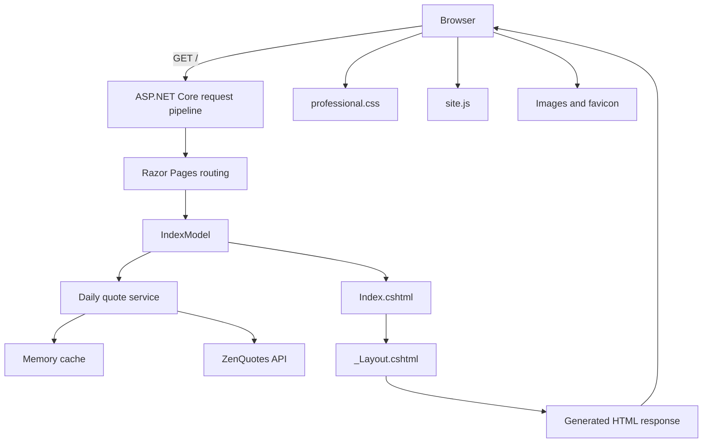

# Portfolio Website Documentation

## Project information

| Item | Value |
| --- | --- |
| Project | Seth Andrey Jabagat — Developer Portfolio |
| Application type | ASP.NET Core Razor Pages web application |
| Language | C# |
| Framework | .NET 8 / ASP.NET Core 8 |
| Frontend | Razor, HTML5, CSS3, and JavaScript |
| Deployment | Docker and Render |
| Production URL | <https://seth-jabagat-portfolio.onrender.com/> |
| Source repository | <https://github.com/gsi78eywh/csharp-portfolio> |

This document explains how the portfolio works, how to run and modify it, why it is responsive, how the résumé is formatted, and how the application is deployed.

## Table of contents

1. [Purpose](#1-purpose)
2. [Features](#2-features)
3. [Technology stack](#3-technology-stack)
4. [Prerequisites](#4-prerequisites)
5. [Run the application](#5-run-the-application)
6. [Project structure](#6-project-structure)
7. [Application architecture](#7-application-architecture)
8. [Application startup](#8-application-startup)
9. [Razor Pages and data rendering](#9-razor-pages-and-data-rendering)
10. [Models](#10-models)
11. [Daily quote service](#11-daily-quote-service)
12. [Responsive design](#12-responsive-design)
13. [JavaScript behavior](#13-javascript-behavior)
14. [Résumé page](#14-résumé-page)
15. [Accessibility](#15-accessibility)
16. [Content editing guide](#16-content-editing-guide)
17. [Build and validation](#17-build-and-validation)
18. [Docker and Render deployment](#18-docker-and-render-deployment)
19. [Troubleshooting](#19-troubleshooting)
20. [Recommended learning path](#20-recommended-learning-path)
21. [Maintenance checklist](#21-maintenance-checklist)
22. [Glossary](#22-glossary)

## 1. Purpose

The application is a professional portfolio for presenting:

- Personal and professional information
- Education and scholarship background
- Technical capabilities
- Training and certifications
- Academic, company, and community projects
- Experience and involvement
- Contact and professional profile links
- A printable one-page résumé

The project is also a practical learning example for C#, ASP.NET Core, Razor Pages, responsive design, API integration, Git, Docker, and cloud deployment.

## 2. Features

- Responsive recruiter-focused portfolio layout
- Separate desktop, tablet, and mobile layouts
- Dynamic portfolio content stored in C# collections
- Clickable education cards linked to official institution websites
- Public GitHub repository links for available projects
- Honest private-repository labels when source code is not public
- Daily quote retrieved from the ZenQuotes API
- In-memory quote caching
- Built-in fallback quote if the API is unavailable
- Mobile navigation menu
- Semantic HTML and keyboard focus styles
- Print-ready A4 résumé
- Docker multi-stage production build
- Render health and version endpoints
- Automatic Render deployment configuration for the `main` branch

## 3. Technology stack

### Backend

- C#
- .NET 8
- ASP.NET Core 8
- Razor Pages
- Dependency injection
- `HttpClient`
- In-memory caching

### Frontend

- Razor syntax
- Semantic HTML5
- CSS Grid
- Flexbox
- CSS custom properties
- Media queries
- JavaScript

### Delivery

- Git
- GitHub
- Docker
- Render

## 4. Prerequisites

Required software:

- .NET SDK 8.0 or later in the .NET 8 family
- Visual Studio Code
- C# extension for Visual Studio Code
- Git
- A modern web browser

Check the installed .NET SDK:

```powershell
dotnet --version
```

The expected result is an `8.0.x` version, for example:

```text
8.0.424
```

If `dotnet` is installed only for the current Windows user, run it explicitly:

```powershell
& "$env:LOCALAPPDATA\Microsoft\dotnet\dotnet.exe" --version
```

No administrator installation is required when the SDK is installed in the user profile.

## 5. Run the application

Open PowerShell in the project directory:

```powershell
cd "C:\Users\SethAndreyJabagat\AppC#-project\PortfolioWeb"
```

Restore dependencies:

```powershell
dotnet restore
```

Build the project:

```powershell
dotnet build
```

Run the website:

```powershell
dotnet run --launch-profile http
```

Open the local address shown in the terminal. The configured HTTP profile normally uses:

```text
http://localhost:5247
```

Stop the server with `Ctrl+C`.

If the global `dotnet` command is unavailable, use:

```powershell
& "$env:LOCALAPPDATA\Microsoft\dotnet\dotnet.exe" run --launch-profile http
```

## 6. Project structure

```text
PortfolioWeb/
├── Program.cs
├── PortfolioWeb.csproj
├── Models/
│   ├── PortfolioContent.cs
│   └── PortfolioProject.cs
├── Services/
│   ├── IDailyQuoteService.cs
│   └── ZenQuotesDailyQuoteService.cs
├── Pages/
│   ├── Index.cshtml
│   ├── Index.cshtml.cs
│   ├── Resume.cshtml
│   ├── Error.cshtml
│   ├── _ViewImports.cshtml
│   ├── _ViewStart.cshtml
│   └── Shared/
│       └── _Layout.cshtml
├── wwwroot/
│   ├── css/
│   │   ├── professional.css
│   │   └── resume.css
│   ├── js/
│   │   └── site.js
│   ├── images/
│   │   └── education/
│   └── favicon.svg
├── Dockerfile
├── render.yaml
├── README.md
└── DOCUMENTATION.md
```

### File responsibilities

| File | Responsibility |
| --- | --- |
| `Program.cs` | Starts ASP.NET Core and configures services and routes |
| `PortfolioWeb.csproj` | Defines the .NET web project and target framework |
| `Models/*.cs` | Defines structured portfolio data types |
| `Pages/Index.cshtml.cs` | Stores portfolio content and loads the daily quote |
| `Pages/Index.cshtml` | Converts page-model data into portfolio HTML |
| `Pages/Resume.cshtml` | Provides the standalone printable résumé |
| `Pages/Shared/_Layout.cshtml` | Provides shared metadata, navigation, and footer |
| `professional.css` | Styles the portfolio and responsive layouts |
| `resume.css` | Styles the screen and printed résumé |
| `site.js` | Controls the navigation and page interactions |
| `Dockerfile` | Builds the production container image |
| `render.yaml` | Describes the Render web service |

## 7. Application architecture

The project follows a simple separation of responsibilities:



### Request lifecycle

1. The browser requests `/`.
2. ASP.NET Core receives the request.
3. Razor Pages routing selects `Pages/Index.cshtml`.
4. Dependency injection creates `IndexModel`.
5. `OnGetAsync` requests the daily quote.
6. The quote service returns cached, remote, or fallback data.
7. Razor combines `IndexModel`, `Index.cshtml`, and `_Layout.cshtml`.
8. ASP.NET Core sends generated HTML to the browser.
9. The browser downloads CSS, JavaScript, logos, and other static assets.
10. CSS adapts the page to the current screen width.

## 8. Application startup

`Program.cs` uses top-level C# statements:

```csharp
var builder = WebApplication.CreateBuilder(args);
```

The C# compiler generates the required `Main` entry point automatically.

### Service registration

```csharp
builder.Services.AddRazorPages();
builder.Services.AddMemoryCache();
builder.Services.AddHttpClient<IDailyQuoteService, ZenQuotesDailyQuoteService>();
```

- `AddRazorPages` enables Razor Pages.
- `AddMemoryCache` provides temporary server-side caching.
- `AddHttpClient` registers the daily quote service and its HTTP client.

### Middleware and endpoints

```csharp
app.UseStaticFiles();
app.UseRouting();
app.UseAuthorization();
app.MapRazorPages();
app.Run();
```

The order is important:

- Static files must be available before the page references CSS or images.
- Routing must identify the requested page.
- Razor Pages endpoints must be mapped before the application starts serving requests.

### Deployment port

Render can provide a `PORT` environment variable. The application reads it with:

```csharp
if (int.TryParse(Environment.GetEnvironmentVariable("PORT"), out int deploymentPort))
{
    builder.WebHost.UseUrls($"http://0.0.0.0:{deploymentPort}");
}
```

This lets the same application run locally and in the cloud.

### Health and version endpoints

```text
/health
/version
```

`/health` returns a successful response when the application is running. Render uses this endpoint to verify the service.

`/version` returns the configured portfolio release value.

## 9. Razor Pages and data rendering

`Pages/Index.cshtml` begins with:

```razor
@page
@model IndexModel
```

`@page` makes the file routable. `@model IndexModel` connects the markup to `Index.cshtml.cs`.

### Display a property

Page model:

```csharp
public string Location { get; } = "Dalaguete, Cebu, Philippines";
```

Razor view:

```razor
<p>@Model.Location</p>
```

### Render a collection

```razor
@foreach (var experience in Model.Experience)
{
    <article>
        <p>@experience.Period</p>
        <h3>@experience.Role</h3>
        <span>@experience.Description</span>
    </article>
}
```

This avoids manually duplicating the entire HTML structure for every item.

### Conditional rendering

```razor
@if (!string.IsNullOrWhiteSpace(project.RepositoryUrl))
{
    <a href="@project.RepositoryUrl">View GitHub repository</a>
}
else
{
    <span>Repository not public</span>
}
```

The page displays a repository button only when a valid URL exists.

## 10. Models

Models describe the data required by the interface.

Example project model:

```csharp
public sealed record PortfolioProject(
    string Title,
    string Period,
    string Description,
    IReadOnlyList<string> Technologies,
    string Status,
    string? RepositoryUrl = null);
```

### Important C# concepts

- `record` creates a compact data-focused type.
- `sealed` prevents another class from inheriting from the record.
- `IReadOnlyList<T>` allows the view to read without modifying the collection.
- `string?` means the value is allowed to be null.
- `= null` provides a default value when no repository is supplied.

## 11. Daily quote service

The quote system uses an interface:

```csharp
public interface IDailyQuoteService
{
    Task<DailyQuote> GetTodayAsync(CancellationToken cancellationToken = default);
}
```

The implementation follows this sequence:

```text
Look for today's quote in memory cache
          ↓
Found → Return cached quote
          ↓ Not found
Request ZenQuotes API
          ↓
Valid result → Cache until the next day and return
          ↓ Invalid or unavailable
Cache and return the built-in fallback quote
```

### Why caching is used

- Reduces unnecessary external requests
- Improves response time
- Reduces dependency on the remote service
- Keeps the quote consistent during the day

### Why a fallback is used

An external API may time out, become unavailable, or return invalid JSON. The fallback prevents an API problem from crashing the portfolio.

Handled exceptions include:

- `HttpRequestException`
- `TaskCanceledException`
- `JsonException`

## 12. Responsive design

The portfolio uses a constrained responsive container:

```css
--shell: min(1120px, calc(100% - 48px));
```

This means the content is never wider than `1120px` and retains space at the left and right edges on smaller screens.

### Main layout tools

- CSS Grid for page sections and card collections
- Flexbox for navigation, buttons, and smaller groups
- `minmax()` to prevent grid columns from overflowing
- `clamp()` for flexible headings
- `max-width` for readable paragraph lengths
- Media queries for tablet and phone layouts
- `overflow-wrap` for long content

### Breakpoints

| Width | Main behavior |
| --- | --- |
| Above `1000px` | Full desktop layout |
| `1000px` and below | Hero and large two-column sections stack |
| `760px` and below | Mobile navigation and single-column cards |
| `500px` and below | Compact spacing and full-width action buttons |

Example:

```css
@media (max-width: 760px) {
  .project-grid {
    grid-template-columns: 1fr;
  }
}
```

The two-column project grid becomes a single column on mobile.

### Responsive typography

```css
font-size: clamp(3.7rem, 6.6vw, 5.6rem);
```

`clamp()` specifies:

1. Minimum size
2. Preferred viewport-based size
3. Maximum size

This prevents the heading from becoming too small or too large.

### Mobile buttons

At small widths, action buttons become full-width rows. This provides larger touch targets and prevents overlapping.

## 13. JavaScript behavior

`wwwroot/js/site.js` handles the navigation menu and header state.

### Mobile menu

```javascript
const isOpen = menu?.classList.toggle("open") ?? false;
```

The script adds or removes the `open` class. CSS controls whether the navigation is visible.

### Automatic closing

When a navigation link is selected, the script closes the mobile menu and resets `aria-expanded`.

### Header state

The script adds a `scrolled` class when the visitor moves down the page. CSS uses this class to add a subtle shadow.

### Progressive behavior

The main portfolio content remains readable even if JavaScript is unavailable. JavaScript enhances navigation and presentation but does not contain the portfolio content.

## 14. Résumé page

`Pages/Resume.cshtml` uses:

```razor
@{
    Layout = null;
}
```

This gives the résumé an independent document layout without the portfolio navigation or footer.

### Résumé standards

- A4 document size
- 0.5-inch (`12.7mm`) print margins
- Segoe UI with Arial and Helvetica fallbacks
- Single-page PDF layout
- Consistent heading hierarchy
- Compact but readable descriptions
- Clickable professional and public project links
- Print-safe section and article behavior

### Print CSS

```css
@media print {
  @page {
    size: A4;
    margin: 0;
  }

  .resume-actions {
    display: none;
  }
}
```

The on-screen navigation and print button are removed from the printed document.

### Save as PDF

1. Open `/Resume`.
2. Select **Print / Save as PDF**.
3. Choose **Save as PDF**.
4. Select **A4** paper size.
5. Disable browser **Headers and footers**.
6. Save the document.

## 15. Accessibility

The application includes:

- Semantic sections and headings
- A skip-to-content link
- Visible keyboard focus states
- Alternative text for education images
- `aria-label` and `aria-labelledby` relationships
- Decorative content hidden with `aria-hidden="true"`
- Buttons and links with clear labels
- Reduced-motion support
- Sufficiently large mobile touch targets

Example:

```html
<section aria-labelledby="projects-title">
    <h2 id="projects-title">Projects with a purpose.</h2>
</section>
```

## 16. Content editing guide

### Change the professional role

Edit `Pages/Index.cshtml.cs`:

```csharp
public string Role { get; } = "Your updated role";
```

Update the matching role in `Pages/Resume.cshtml`.

### Add an education item

Add another record to the `Education` collection:

```csharp
new(
    "Program name",
    "Year – Year",
    "Institution name",
    "/images/education/logo.png",
    "Institution logo",
    "https://institution.example/",
    true)
```

Place the logo in:

```text
wwwroot/images/education/
```

### Add a project

Add another item to the `Projects` collection:

```csharp
new(
    "Project title",
    "Project period or context",
    "Short result-focused description.",
    ["Technology 1", "Technology 2", "Technology 3"],
    "Status",
    "https://github.com/username/repository")
```

If the repository is private, omit the final URL:

```csharp
new(
    "Private project",
    "Company project",
    "Description without confidential information.",
    ["Power Apps", "Power Automate"],
    "Private")
```

### Add a skill group

```csharp
new("Category", ["Skill 1", "Skill 2", "Skill 3"])
```

### Update social links

Edit the contact section in `Pages/Index.cshtml` and the contact block in `Pages/Resume.cshtml`.

### Add a professional photo

1. Add a compressed image to `wwwroot/images/`.
2. Prefer WebP or an optimized JPEG.
3. Replace or extend the `.profile-monogram` element in `Index.cshtml`.
4. Use descriptive alternative text.
5. Style the image with `object-fit: cover` and an appropriate `object-position`.
6. Test the image at desktop and mobile widths.

## 17. Build and validation

### Development build

```powershell
dotnet build
```

### Release build

```powershell
dotnet build -c Release
```

### Clean restore and build

```powershell
dotnet clean
dotnet restore
dotnet build -c Release
```

### Manual validation checklist

- Home page returns HTTP 200
- Résumé page returns HTTP 200
- CSS files return HTTP 200
- Education logos load
- Navigation links reach the correct sections
- GitHub project links open the correct repositories
- Institution links open official websites
- Teams and email actions work
- Mobile navigation opens and closes
- No horizontal overflow appears at phone widths
- Résumé exports to one A4 page
- `/health` returns a healthy response

## 18. Docker and Render deployment

### Docker build stages

The Dockerfile uses a multi-stage build.

Build stage:

```dockerfile
FROM mcr.microsoft.com/dotnet/sdk:8.0.424 AS build
RUN dotnet publish -c Release -o /app --no-restore
```

Runtime stage:

```dockerfile
FROM mcr.microsoft.com/dotnet/aspnet:8.0.30 AS runtime
ENTRYPOINT ["dotnet", "PortfolioWeb.dll"]
```

The SDK image compiles the project. The smaller ASP.NET runtime image runs the published application.

### Deployment sequence

```text
Local change
    ↓
Git commit
    ↓
Push to GitHub main
    ↓
Render detects commit
    ↓
Render builds Docker image
    ↓
Container starts PortfolioWeb.dll
    ↓
Render requests /health
    ↓
Successful deployment becomes live
```

### Deploy an update

```powershell
git status
git add <changed-files>
git commit -m "Describe the update"
git push origin main
```

If Render does not automatically start:

1. Open the `seth-jabagat-portfolio` service.
2. Select **Manual Deploy**.
3. Select **Deploy latest commit**.
4. Confirm the correct Git commit.
5. Wait for **Deploy live**.
6. Refresh the public site with `Ctrl+F5`.

Do not deploy the failed duplicate service if one is still visible in the dashboard.

### Free service behavior

The free Render instance may spin down after inactivity. The first visitor after inactivity may experience a longer loading time while the service starts again. The deployment itself does not expire solely because the service spins down.

## 19. Troubleshooting

### CS5001: no suitable Main method

Confirm the project uses:

```xml
<Project Sdk="Microsoft.NET.Sdk.Web">
```

Confirm `Program.cs` exists and contains the ASP.NET Core startup code. Top-level statements generate `Main` automatically.

### Access denied when starting the generated EXE

The project uses:

```xml
<UseAppHost>false</UseAppHost>
```

This prevents reliance on a generated Windows `.exe`. Run through the .NET host:

```powershell
dotnet run
```

### C# extension reports problems loading individual `.cs` files

C# source files are not separate projects. Open the directory containing the `.csproj` file in Visual Studio Code.

For practice exercises, create separate projects:

```powershell
dotnet new console -n VariablesPractice
dotnet new console -n LoopsPractice
dotnet new console -n MethodsPractice
```

### HTTP 500 on Render

Check:

- Render deployment logs
- The first exception message
- Environment variables
- Runtime and SDK versions
- `/health` response
- Whether the latest Git commit was deployed

### Render status 139

Status 139 normally indicates the Linux process terminated unexpectedly. Use the pinned SDK/runtime versions in the Dockerfile and inspect the first error in the deployment log rather than only the final status line.

### Website did not update after push

1. Verify the commit exists on GitHub `main`.
2. Check the active Render service.
3. Confirm Render is deploying the latest commit.
4. Use **Manual Deploy → Deploy latest commit** if necessary.
5. Hard-refresh the browser with `Ctrl+F5`.

### Daily quote does not update

The service caches one quote per UTC date. When the API is unavailable, the fallback is cached temporarily. This is expected behavior and protects page availability.

### Mobile content overlaps

Check:

- Fixed widths
- Long unbroken URLs
- Missing `min-width: 0` on grid children
- Missing `overflow-wrap`
- Incorrect media-query ordering
- Fixed-position buttons that are too large

Use browser developer tools and test at `320px`, `375px`, `390px`, `768px`, and desktop widths.

## 20. Recommended learning path

### Phase 1: C# foundations

Learn:

- Variables and types
- Conditions
- Loops
- Methods
- Classes and records
- Collections
- Nullability
- Exceptions
- `async` and `await`

### Phase 2: HTML and CSS

Learn:

- Semantic HTML
- Box model
- Margin and padding
- Flexbox
- Grid
- Responsive units
- Media queries
- Accessibility basics

### Phase 3: ASP.NET Core

Learn:

- Application startup
- Dependency injection
- Middleware
- Routing
- Static files
- Environments
- Logging

### Phase 4: Razor Pages

Learn:

- `@page`
- `@model`
- Page models
- `OnGetAsync`
- Razor loops
- Conditional rendering
- Tag Helpers
- Forms and `OnPostAsync`

### Phase 5: APIs and services

Learn:

- Interfaces
- Typed `HttpClient`
- JSON deserialization
- Caching
- Timeouts
- Fallback behavior
- Cancellation tokens

### Phase 6: Git and deployment

Learn:

- Repository status
- Diffs
- Commits
- Branches
- Push and pull
- Docker images
- Container runtime
- Render logs and health checks

### Portfolio exercises

1. Change the role and summary.
2. Add a skill without changing the Razor markup.
3. Add an education record and logo.
4. Add a public project and repository URL.
5. Add an optional live-demo URL to `PortfolioProject`.
6. Add a new Razor Page.
7. Create a contact form.
8. Add server-side form validation.
9. Store submitted messages in a database.
10. Build a protected administration page for editing portfolio content.

## 21. Maintenance checklist

Review the portfolio at least once per month or after a major project.

- Update project descriptions and outcomes
- Remove outdated or weak skills
- Confirm public repository links
- Confirm institution and social links
- Keep the résumé synchronized with the portfolio
- Test mobile layouts
- Test keyboard navigation
- Export and review the résumé PDF
- Run a Release build
- Check Render health and deployment logs
- Update .NET Docker images when intentionally upgrading framework versions
- Never commit passwords, API keys, or private company data

## 22. Glossary

| Term | Meaning |
| --- | --- |
| ASP.NET Core | Microsoft framework for building web applications with .NET |
| Razor | Syntax that combines HTML and C# |
| Razor Page | A routable `.cshtml` page with an optional page model |
| Page model | C# class that provides data and request handlers to a Razor Page |
| Middleware | Component that handles part of an HTTP request or response |
| Dependency injection | System that creates and provides required services |
| Record | Compact C# type commonly used for structured data |
| Nullable | A type that is permitted to contain `null` |
| Async/await | C# pattern for non-blocking asynchronous work |
| Cache | Temporary storage used to avoid repeating expensive work |
| Responsive design | Layout that adapts to different screen sizes |
| Media query | CSS rule activated at a particular screen or output condition |
| Docker image | Packaged application and runtime filesystem |
| Container | Running instance of a Docker image |
| Health check | Endpoint used to confirm the application is running |
| Environment variable | External configuration value supplied at runtime |

---

This project should be treated as both a professional portfolio and a learning application. Make small changes, build after each change, inspect the result in the browser, and commit only when the behavior is understood and verified.
